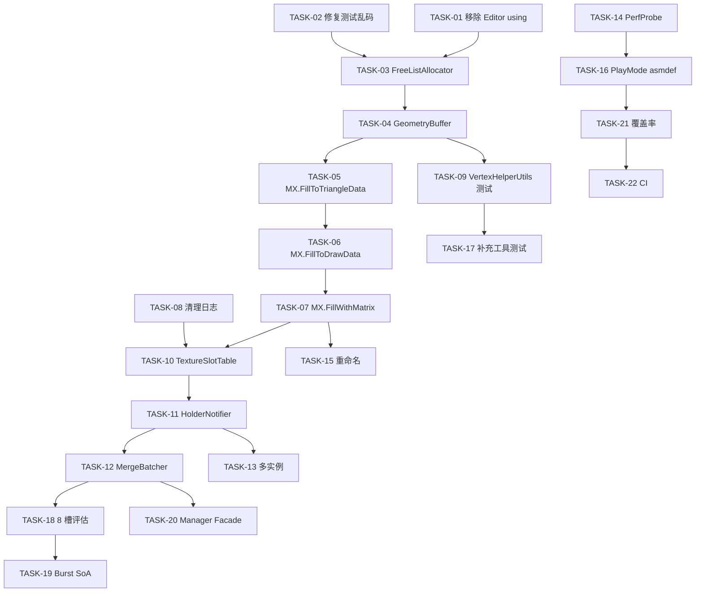

# HUDRenderTest 实施计划

> 版本：1.0
> 日期：2026-05-24
> 配套文档：[架构设计-v2.md](架构设计-v2.md)、[测试用例.md](测试用例.md)、[需求分析.md](需求分析.md)

---

## 0. 执行说明（给其他 Agent）

1. **顺序**：严格按 `阶段 → 任务 ID` 顺序执行。下一任务的"依赖"字段标明前置。
2. **每个任务必产物**：
   - 代码改动（"涉及文件"字段）
   - 关联测试用例**全部通过**（"验收测试 ID"字段，对应 [测试用例.md](测试用例.md)）
3. **执行命令**（来自 [.github/copilot-instructions.md](../../.github/copilot-instructions.md)；按当前仓库基线口径已修正）：
   ```powershell
   "C:\Program Files\Unity\Hub\Editor\2022.3.53f1c1\Editor\Unity.exe" -batchmode -nographics `
     -projectPath "D:\ProjCommon\HUDRenderTest" -runTests -testPlatform EditMode `
     -assemblyNames "Tests" -testResults "Logs\EditModeRepoTests.xml"
   ```
   ```powershell
   .\Tools\Invoke-LocalValidation.ps1
   .\Tools\Invoke-LocalValidation.ps1 -WithCoverage
   .\Tools\Invoke-LocalValidation.ps1 -WithCoverage -CoverageThreshold 70
   .\Tools\Test-CoverageGate.ps1 -SummaryPath ".\CodeCoverage\Local\Report\Summary.xml" -AssemblyName "UIDataRender" -MinimumLineCoverage 70
   ```
   - 仓库自有 EditMode 基线按 `Tests` 程序集统计；不要再用全量 EditMode 结果替代。
   - `Invoke-LocalValidation.ps1` 直接验证**当前工作树**，适合在 CI 因缺少 `UNITY_LICENSE` 或本地 `Packages\com.unity.ugui@1.0.0` 尚未提交时做本地替代验证。
   - `-WithCoverage` 会在 EditMode 基线同时生成 `CodeCoverage\Local\` 下的 HTML / OpenCover 覆盖率产物；`-CoverageThreshold 70` 会对 `UIDataRender` 程序集执行本地行覆盖率门禁。
   - 本仓库批量跑测试时**不要追加 `-quit`**，否则 Unity 会提前退出且不保存预期 XML。
   - 单测过滤：追加 `-testFilter "TestClass.TestMethod"`。
4. **完成判定**：任务完成 = 代码编译通过 + 所有验收 TC-ID 全绿 + 无 `using TreeEditor` / `using UnityEditor` 残留于 Runtime 程序集。
5. **需求变更先确认**：[需求分析.md](需求分析.md) 是当前目标需求文档，实施中发现需求冲突时必须先确认再更新；[项目构架.md](项目构架.md) 作为 v1 历史档不再修改，架构实现细节更新到 [架构设计-v2.md](架构设计-v2.md)。

---

## 1. 阶段与里程碑

| 阶段 | 目标 | 任务范围 | 里程碑出口 |
|---|---|---|---|
| **P0 修复** | 解除构建阻断 + 共享模式可用 | TASK-01..09 | EditMode 全绿；Player Build 成功；`UIMeshDataX` 输出与 `UIMeshData` 等价 |
| **P1 功能完整** | 纹理分批 + 多实例 + 可观测性 | TASK-10..16 | `MergeBatcher` 接管合批；HUD 测试场景跑通；CSV 报告产出 |
| **P2 性能与重构** | 拆分单例 + Burst SoA + 命名整理 | TASK-17..22 | 主线程 < 1.0ms 验证；`UIPrefabManager` 拆分完成 |

---

## 2. P0 任务清单

### TASK-01：移除 Runtime 程序集对 Editor namespace 的引用

- **依赖**：无
- **涉及文件**：
  - `Assets/Scripts/UIDataRender/Mesh/UIMeshData.cs`（删除 `using TreeEditor`）
  - `Assets/Scripts/UIDataRender/Mesh/UIMeshDataX.cs`（删除 `using TreeEditor`）
  - `Assets/Scripts/UIDataRender/Prefab/UIPrefabManager.cs`（删除 `using UnityEditor`，或用 `#if UNITY_EDITOR` 包裹）
- **验收测试 ID**：TC-BUILD-01（Player Build 在批模式下编译通过）
- **风险**：低

### TASK-02：补全 `TestUIGeometry` 现有用例的乱码注释与命名

- **依赖**：无
- **涉及文件**：`Assets/Tests/EditMode/TestUIGeometry.cs`（迁移自 `Assets/Tests/TestUIGeometry.cs`）
- **改动**：注释统一 UTF-8；`AssetFull` → `AssertFull`
- **验收测试 ID**：TC-UG-01..10（保持现有 10 用例全部通过）
- **风险**：极低

### TASK-03：抽出 `FreeListAllocator`（纯算法）

- **依赖**：TASK-02
- **涉及文件**：
  - 新增 `Assets/Scripts/UIDataRender/Geometry/FreeListAllocator.cs`
  - 新增 `Assets/Scripts/UIDataRender/Geometry/MeshSlim.cs`（从 `UIMeshDataX.cs` 抽出）
  - 修改 `Assets/Scripts/UIDataRender/Geometry/UIGeometry.cs`（内部委托）
- **验收测试 ID**：TC-FA-01..08、TC-UG-01..10（兼容）
- **风险**：中（重构需保持外部 API 兼容）

### TASK-04：抽出 `GeometryBuffer` + 实现统一扩容

- **依赖**：TASK-03
- **涉及文件**：
  - 新增 `Assets/Scripts/UIDataRender/Geometry/GeometryBuffer.cs`
  - 修改 `Assets/Scripts/UIDataRender/Geometry/UIGeometry.cs`（使用 `GeometryBuffer`）
- **核心改动**：所有扩容路径调用 `GeometryBuffer.EnsureVertexCapacity` / `EnsureIndexCapacity`，五数组同步增长
- **验收测试 ID**：TC-GB-01..04、TC-UG-11（新增扩容用例）、TC-UG-12（新增 ReAlloc 用例）
- **风险**：中（必须保证现有 `Alloc(4,6)×N` 行为不变）

### TASK-05：修复 `UIMeshDataX.FillToTriangleData` 索引 offset（GAP-04）

- **依赖**：TASK-04
- **涉及文件**：`Assets/Scripts/UIDataRender/Mesh/UIMeshDataX.cs`
- **改动**：按 [架构设计-v2 §4.2](架构设计-v2.md#42-uimeshdataxfilltotriangledata修正-gap-04) 重写
- **验收测试 ID**：TC-MX-04
- **风险**：高（共享路径基础）

### TASK-06：实现 `UIMeshDataX.FillToDrawData`（GAP-02）

- **依赖**：TASK-05
- **涉及文件**：`Assets/Scripts/UIDataRender/Mesh/UIMeshDataX.cs`
- **改动**：按 [架构设计-v2 §4.1](架构设计-v2.md#41-uimeshdataxfilltodrawdata修正-gap-02) 实现
- **验收测试 ID**：TC-MX-01、TC-MX-02、TC-MX-03
- **风险**：高

### TASK-07：实现 `UIMeshDataX.FillWithMatrix`（GAP-03）

- **依赖**：TASK-06
- **涉及文件**：`Assets/Scripts/UIDataRender/Mesh/UIMeshDataX.cs`、`Assets/Scripts/UIDataRender/Abstraction/Core.cs`（接口添加 `FillWithMatrix`）、`Assets/Scripts/UIDataRender/Mesh/UIMeshData.cs`（声明已实现）
- **改动**：按 [架构设计-v2 §4.3](架构设计-v2.md#43-uimeshdataxfillwithmatrix修正-gap-03) 实现
- **验收测试 ID**：TC-MX-05、TC-MX-06、TC-UM-03
- **风险**：高

### TASK-08：清理 Runtime `Debug.LogError` 噪声

- **依赖**：无（可并行）
- **涉及文件**：`UIMeshData.cs`、`UIMeshDataX.cs`、`UIPrefabManager.cs`
- **改动**：构造函数日志、`GetTextureIndex`、`OnTextureRegister/UnRegister` 改为 `[Conditional("UI_VERBOSE")] LogDebug` 包装
- **验收测试 ID**：TC-LOG-01（默认 Define 下日志计数 ≤ 0）
- **风险**：低

### TASK-09：补 `VertexHelperUtils` 单测

- **依赖**：TASK-04
- **涉及文件**：新增 `Assets/Tests/EditMode/TestVertexHelperUtils.cs`
- **验收测试 ID**：TC-VHU-01、TC-VHU-02（关键：索引带 vertexOffset）
- **风险**：中（需要构造 `VertexHelper` 测试 fixture）

---

## 3. P1 任务清单

### TASK-10：抽出 `TextureSlotTable`

- **依赖**：TASK-08
- **涉及文件**：新增 `Assets/Scripts/UIDataRender/Prefab/TextureSlotTable.cs`、修改 `UIPrefabManager.cs`（委托）
- **改动**：`MaxImageSlots` 默认 3；`Register` 超容量**仍然注册成功**（追加槽位 + 返回新槽号），同时 `Debug.LogWarning` 提示;**已放弃 v1 草案的 `return -1` 失败语义**，分批责任完全交给 `MergeBatcher`。`Register` 只在 `texture == null` 时返回 -1。
- **验收测试 ID**：TC-TST-01..06
- **风险**：中

### TASK-11：抽出 `HolderNotifier`（反向索引）

- **依赖**：TASK-10
- **涉及文件**：新增 `Assets/Scripts/UIDataRender/Prefab/HolderNotifier.cs`、修改 `UIPrefabManager.cs`
- **验收测试 ID**：TC-HN-01、TC-HN-02
- **风险**：中

### TASK-12：实现 `MergeBatcher` ✅

- **依赖**：TASK-11
- **涉及文件**：新增 `Assets/Scripts/UIDataRender/Render/MergeBatcher.cs`、`RenderBatch.cs`、`MaterialBinder.cs`、`HolderBatchRenderer.cs`
- **改动**：在合并循环外增加分批阶段；Holder 渲染入口统一经 `HolderBatchRenderer` 执行 `MergeBatcher.Plan` → `RenderBatch` → `MaterialBinder.Bind`；超阈值时 `LogWarning`
- **验收测试 ID**：TC-MB-01..05
- **风险**：中

### TASK-13：修复 `UIPrefabRegistration` 多实例差异化 ✅

- **依赖**：TASK-11
- **涉及文件**：`Assets/Scripts/UIDataRender/Prefab/UIPrefabRegistration.cs`、`Assets/Scripts/UIDataRender/Prefab/DataPrefabHolder.cs`
- **改动**：`UIPrefabRegistration` 仅持 draws **模板**；实例文字/精灵差异由 `DataPrefabHolder<T>` 实例持有
- **验收测试 ID**：TC-REG-01（多实例同 Prefab 内容独立）
- **风险**：中

### TASK-14：实现 `PerfProbe` ✅

- **依赖**：无（可与 10-13 并行）
- **涉及文件**：新增 `Assets/Scripts/UIDataRender/Diagnostics/PerfProbe.cs`
- **改动**：插入到 `DataPrefabHolder.Fill`、Holder 合批构建、`Graphics.DrawMesh` 三个埋点；运行路径通过 `PerfProbe.Record` 采样并支持 CSV 落盘
- **验收测试 ID**：TC-PP-01、TC-PP-02、TC-PP-03
- **风险**：低

### TASK-15：重命名 `UIPrefaHolder` → `UIPrefabHolder` ✅

- **依赖**：所有 P0 完成
- **涉及文件**：`Assets/Scripts/UIDataRender/UIPrefaHolder.cs` → `UIPrefabHolder.cs`；所有引用方
- **改动**：同步重命名 `.meta` 文件以保持 GUID（避免预制体引用丢失）
- **验收测试 ID**：编译通过 + 所有现有用例通过
- **风险**：中（务必保留原 .meta GUID）

### TASK-16：新增 PlayMode 测试程序集 ✅

- **依赖**：TASK-14
- **涉及文件**：新增 `Assets/Tests/TestUIDataRender.PlayMode.asmdef`
- **验收测试 ID**：TC-JOB-01、TC-JOB-02、TC-LIFE-01
- **风险**：低

---

## 4. P2 任务清单

### TASK-17：补充 `SharedArray` / `UnsafeFastCopy` / `CalcMatrix` 单测 ✅

- **依赖**：TASK-09
- **涉及文件**：新增 3 个测试文件（见 [架构设计-v2 §5](架构设计-v2.md#5-目录结构v2-调整)）
- **验收测试 ID**：TC-SA-01、TC-UFC-01..02、TC-MTX-01..02

### TASK-18：评估 Shader 8 槽扩展 ✅

- **依赖**：TASK-12
- **涉及文件**：`Assets/Resources/Shader/UIE-AtlasBlit.shader`
- **改动**：增加 `_MainTex4.._MainTex7`，跑 [PerfProbe](架构设计-v2.md#29-perfprobe) 对比；如分支开销可接受则将 `MaxImageSlots` 默认改为 7
- **验收**：3 分钟测试场景，主线程 avg < 1.0ms，DrawCall avg ≤ 5

### TASK-19：Burst SoA 改造（可选）✅（输出等价已覆盖，性能量化待基线）

- **依赖**：TASK-18 数据支持
- **涉及文件**：新增 `Assets/Scripts/UIDataRender/Jobs/MergeJobs.Burst.cs`、`Assets/Tests/PlayMode/TestBurstMergeJobs.cs`
- **改动**：将 `UIMeshData[]` 平铺为 `NativeArray<MeshSlimSoA>` + `NativeArray<Vector3>` / `Vector4` / `Color32` / `int` 等 SoA 输入，启用 `[BurstCompile]`，保留 `ManagedCodeInJob` 为兼容路径
- **验收测试 ID**：TC-JOB-03（输出等价）
- **剩余验收**：性能 ≥ 2× 提升需在 T-S/T-V 基线中用 Unity Profiler / PerfProbe 量化，不由 `dotnet build` 判定

### TASK-20：拆分 `UIPrefabManager` 为 Facade ✅

- **依赖**：TASK-12
- **涉及文件**：`UIPrefabManager.cs`
- **改动**：保留 API；内部全部委托给 4 个新类
- **验收**：现有调用方零改动 + 所有 P0/P1 用例继续通过

### TASK-21：启用代码覆盖率 ✅

- **依赖**：所有测试落地
- **涉及文件**：`Packages/manifest.json` 增加 `com.unity.testtools.codecoverage`
- **目标**：`UIDataRender` 程序集行覆盖 ≥ 70%

### TASK-22：CI 集成（可选）✅

- **依赖**：TASK-21
- **涉及文件**：新增 `.github/workflows/unity-tests.yml`
- **改动**：在 PR 上自动跑 EditMode + PlayMode 测试

---

## 5. 任务依赖图



---

## 6. 验收门槛

| 门槛 | 判定 |
|---|---|
| **P0 出口** | TASK-01..09 全部完成；TC-BUILD-01、TC-UG-*、TC-FA-*、TC-GB-*、TC-MX-*、TC-UM-03、TC-VHU-*、TC-LOG-01 全绿 |
| **P1 出口** | TASK-10..16 全部完成；TC-TST-*、TC-HN-*、TC-MB-*、TC-REG-01、TC-PP-*、TC-JOB-*、TC-LIFE-01 全绿；HUD 测试场景跑通 |
| **P2 出口** | TASK-17..21 完成；HUD 场景 3 分钟测试主线程 avg < 1.0ms、DrawCall avg ≤ 5；UIDataRender 程序集行覆盖 ≥ 70% |

---

## 7. 回滚策略

- 所有 P0 修复 **保持 `UIGeometry` / `UIPrefabManager` 公共 API 兼容**，回滚仅需删除新文件并 revert 几行内部委托。
- TASK-15（重命名）需要 `git mv` 同时移动 `.meta` 文件；如出现预制体丢失引用，从 `git reflog` 回滚至重命名前提交。
- TASK-19（Burst SoA）以新增独立路径方式实现，通过开关切换；不替换 `ManagedCodeInJob`，可随时回退。

---

*执行任一任务前请先打开 [测试用例.md](测试用例.md)，确认"验收测试 ID"对应的 TC 已就绪或可同时新增。*
