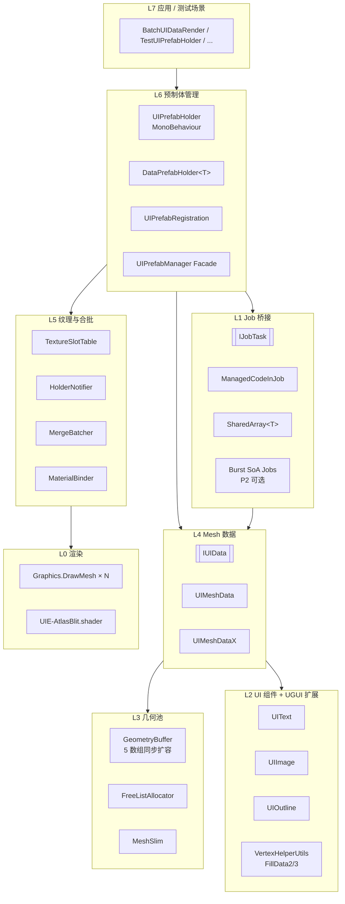

# HUDRenderTest 架构设计 v2.0

> 版本：2.0
> 日期：2026-05-24
> 状态：**Canonical**（取代 [项目构架.md](项目构架.md) v1.0 中的设计章节，作为后续实施的唯一源）
> 关联文档：[需求分析.md](需求分析.md)、[实施计划.md](实施计划.md)、[测试用例.md](测试用例.md)

---

## 0. v2 相对 v1 的关键变更

| 变更点 | v1.0 | v2.0 |
|---|---|---|
| Strategy 模式契约 | `UIMeshData` / `UIMeshDataX` 实现部分等价 | **强制等价**：相同输入下两者输出（顶点/UV/颜色/索引）必须按位一致，由 [TC-MX-01..06](测试用例.md#mx-双数据模式等价性) 保障 |
| 几何池扩容 | 仅 `vertex` / `indices` 扩容 | **GeometryBuffer 一体化扩容**：四数组（vertex/uvs/colors/drawVertex）+ indices 由统一入口 `GrowAllBuffers` 同步扩容 |
| 纹理管理 | `UIPrefabManager` 全功能聚合 | 拆分为 `TextureSlotTable` + `HolderNotifier` + Facade |
| 纹理通知 | 全表 O(holders × meshdata) 扫描 | 反向索引 `Dictionary<int slotIndex, List<IUIData>>` |
| 纹理槽容量 | 隐式 4 槽（1 字体 + 3 图片） | 显式 `MaxImageSlots` 配置（默认 3，可扩 7），超额触发 `MergeBatcher` 分批 |
| 合批 | 单一合并缓冲 → 单 DrawMesh | `MergeBatcher` 按纹理集合产出 N 个批次 → N 次 DrawMesh + 告警日志 |
| Job 桥接 | `ManagedCodeInJob` 唯一路径 | 保留为兼容路径；新增 **SoA Burst 路径**（P2，可选） |
| Runtime 程序集污染 | 含 `TreeEditor` / `UnityEditor` | **禁止**：靠 asmdef 校验 + `#if UNITY_EDITOR` 隔离 |
| 可观测性 | 仅 `Debug.LogError` | `PerfProbe` + `ProfilerMarker` + CSV 落盘 |
| 测试 | 仅 `UIGeometry` 10 个用例 | 关键算法 23 项 → 25+ 用例覆盖（见 [测试用例.md](测试用例.md)） |

---

## 1. 分层架构（v2）



---

## 2. 新增/重构模块定义

### 2.1 `GeometryBuffer`（新增，从 `UIGeometry` 拆出）

**位置**：`Assets/Scripts/UIDataRender/Geometry/GeometryBuffer.cs`

**职责**：唯一拥有 `vertex / drawVertex / uvs / colors / indices` 五个并行数组。**所有扩容必须经过该类**。

**契约**：
- `EnsureVertexCapacity(int minCap)`：保证 4 个顶点向并行数组 `Length >= minCap`，按 `GROWTH=4096` 步长扩容，扩容后旧数据保留。
- `EnsureIndexCapacity(int minCap)`：保证 `indices.Length >= minCap`。
- **不变量**：`vertex.Length == drawVertex.Length == uvs.Length == colors.Length` 任何时刻成立。
- 关联测试：[TC-GB-01..04](测试用例.md#gb-geometrybuffer-扩容一致性)

### 2.2 `FreeListAllocator`（新增，从 `UIGeometry` 拆出）

**位置**：`Assets/Scripts/UIDataRender/Geometry/FreeListAllocator.cs`

**职责**：纯算法类，管理 `LinkedList<VertexSlice>` 的 Alloc / Release / ReAlloc。

**契约**：
- `Alloc(int count)` → `(int offset, bool grew)`：找精确匹配 → 拆分大块 → 触发回调 `GrowCallback` → 重试。
- `Release(int start, int count)`：覆盖原 5 种合并 case + **新增 case 0**（独立块、链表中段非头尾）。
- 关联测试：[TC-FA-01..08](测试用例.md#fa-freelistallocator)

### 2.3 `UIGeometry`（保留，退化为 Facade）

聚合 `GeometryBuffer` + 两个 `FreeListAllocator`（顶点/索引）。对外 API 保持兼容（`Alloc`/`Release`/`ReAlloc`）以减少调用方改动。

### 2.4 `TextureSlotTable`（新增，从 `UIPrefabManager` 拆出）

**位置**：`Assets/Scripts/UIDataRender/Prefab/TextureSlotTable.cs`

**职责**：纯状态机，管理纹理 → 槽位映射。

**契约**：
- `int MaxImageSlots { get; }`（默认 3，可配置 ≤ 7）
- `int Register(int ownerKey, Texture tex)` → 返回槽位索引（1..MaxImageSlots）或 -1
- `Register` 返回 -1 只表示当前 `TextureSlotTable` 容量不足；渲染层必须交给 `MergeBatcher` 将对象拆入新的 Draw Call，而不是丢弃该对象。
- `void Unregister(int ownerKey)` → 引用计数=0 时移除，触发 Swap-with-Last
- 事件 `OnReplaced(int fromIndex, int toIndex)` / `OnRemoved(int index)`
- 反向索引 `Dictionary<int, HashSet<int>> slotToOwners` 用于通知优化
- 关联测试：[TC-TST-01..06](测试用例.md#tst-textureslottable)

### 2.5 `HolderNotifier`（新增）

**位置**：`Assets/Scripts/UIDataRender/Prefab/HolderNotifier.cs`

**职责**：订阅 `TextureSlotTable` 事件，按 `slotToOwners` 反向索引精准更新 `IUIData.UpdateTextureIndex`。

**契约**：
- 复杂度从 O(holders × meshdata) 降至 **O(受影响 owner 数)**
- 关联测试：[TC-HN-01..02](测试用例.md#hn-holdernotifier)

### 2.6 `MergeBatcher`（新增）

**位置**：`Assets/Scripts/UIDataRender/Render/MergeBatcher.cs`

**职责**：合批切片决策。当帧内 UV.z 集合超过 `MaxImageSlots` 时按"贪心首次适应"将 holders 切分为多个批次。

**契约**：
- 输入：`IReadOnlyList<IUIPrefabHolder>` + `TextureSlotTable`
- 输出：`List<RenderBatch>`，每个 `RenderBatch` 含 holder 子集 + 纹理槽映射 + Material 实例
- 超阈值时 `Debug.LogWarning("[MergeBatcher] split into N batches: ...")`
- 关联测试：[TC-MB-01..03](测试用例.md#mb-mergebatcher)

### 2.7 `MaterialBinder`（新增，从 `UIPrefabManager` 拆出）

**位置**：`Assets/Scripts/UIDataRender/Render/MaterialBinder.cs`

**职责**：将批次的纹理列表写入 Material 的 `_MainTex0..N`。

### 2.8 `UIPrefabManager`（保留，退化为 Facade）

聚合上述 4 个新类。对外 API（`Register` / `AddHolder` / `GetTextureIndex` / `UpdateTexture`）保持兼容，内部委托。

### 2.9 `PerfProbe`（新增）

**位置**：`Assets/Scripts/UIDataRender/Diagnostics/PerfProbe.cs`

**职责**：
- 暴露 `ProfilerMarker`：`UIData.Fill` / `UIData.MergeJob` / `UIData.Draw`
- 滑动窗口 N=10800（3min @ 60fps）记录主线程耗时 + DrawCall 数
- `Flush(string deviceTag)` 落盘 `persistentDataPath/perf_<tag>_<utc>.csv`，包含 avg / max
- 关联测试：[TC-PP-01..02](测试用例.md#pp-perfprobe)

---

## 3. 接口契约（v2 强化）

### 3.1 `IUIData`（新增/修正 XML 注释，行为不变）

```
interface IUIData : IDisposable
{
    int TextureIndex { get; set; }

    /// <summary>从 VertexHelper 写入。共享模式必须用 FillData3 并写入 VertexOffset。</summary>
    void FillVertex(VertexHelper toFill, int flags);

    /// <summary>仅改写 uv.z，必须遍历当前实例占用的全部顶点。</summary>
    void UpdateTextureIndex(int index);

    /// <summary>就地变换（共享模式作用于 geometry.vertex 切片，独立模式作用于自身 vertList）。</summary>
    void TransformVertex(Matrix4x4 mtx);

    /// <summary>追加索引到外部 list，共享模式必须以 mesh.IndicesOffset 为基址，顶点写入 geometry.drawVertex[VertexOffset..]。</summary>
    void FillToTriangleData(List<int> triangles_, Vector3 localPosition);

    /// <summary>追加 顶点+UV+颜色+索引 到外部 list。triangles 必须以 vertList_.Count 为基址。</summary>
    void FillToDrawData(List<Vector3> vertList, List<Vector4> uvs, List<Color32> colors, List<int> triangles, Vector3 localPosition);

    /// <summary>新增：矩阵版本，必须与 FillToDrawData 在 mtx=Identity+localPosition 时输出按位一致。</summary>
    void FillWithMatrix(List<Vector3> vertList, List<Vector4> uvs, List<Color32> colors, List<int> triangles, Matrix4x4 mtx);
}
```

> 注：`FillWithMatrix` 提升为接口方法（v1 仅 `UIMeshData` 类内实现），与 P0 修复 `UIMeshDataX.FillWithMatrix` 配套。

### 3.2 `IUIPrefabHolder`（不变）

### 3.3 `ITextureSlotTable` 事件（新增）

```
event Action<int /*from*/, int /*to*/> SlotReplaced;
event Action<int /*index*/> SlotRemoved;
```

---

## 4. 关键算法 v2 规范

### 4.1 `UIMeshDataX.FillToDrawData`（修正 GAP-02）

```
offset = vertList_.Count
for i in [VertexOffset, VertexOffset + VertexCount):
    vertList_.Add(geometry.vertex[i] + localPosition)
    uvs_.Add(geometry.uvs[i])
    colors_.Add(geometry.colors[i] != default ? geometry.colors[i] : Color.white)
for i in [IndicesOffset, IndicesOffset + IndicesCount):
    triangles_.Add(geometry.indices[i] - VertexOffset + offset)
```

注意：`geometry.indices[i]` 是 **以 VertexOffset 为基址** 的（由 `FillData3` 写入时已加），所以追加到 list 时需先减 `VertexOffset`、再加 list 内 offset。

### 4.2 `UIMeshDataX.FillToTriangleData`（修正 GAP-04）

```
for i in [VertexOffset, VertexOffset + VertexCount):
    geometry.drawVertex[i] = geometry.vertex[i] + localPosition
for i in [IndicesOffset, IndicesOffset + IndicesCount):   // ← v1 缺 IndicesOffset
    triangles_.Add(geometry.indices[i])  // 已带 VertexOffset 基址
```

### 4.3 `UIMeshDataX.FillWithMatrix`（修正 GAP-03，等价 4.1 矩阵版）

```
offset = vertList_.Count
for i in [VertexOffset, VertexOffset + VertexCount):
    vertList_.Add(mtx.MultiplyPoint(geometry.vertex[i]))
    uvs_.Add(geometry.uvs[i])
    colors_.Add(...)
for i in [IndicesOffset, IndicesOffset + IndicesCount):
    triangles_.Add(geometry.indices[i] - VertexOffset + offset)
```

### 4.4 `TextureSlotTable.Register`

```
if dict.TryGet(ownerKey, out oldTex):
    if oldTex == tex: return GetSlot(tex)
    Unregister(ownerKey)
dict[ownerKey] = tex
if slotOf(tex) == -1:
    if textures.Count < MaxImageSlots:
        textures.Add(tex); return textures.Count   // 槽位 = 1..N
    else:
        Debug.LogWarning(...); return -1           // 触发 MergeBatcher 分批
return slotOf(tex)
```

### 4.5 `TextureSlotTable.Unregister` + Swap-with-Last

```
tex = dict[ownerKey]; dict.Remove(ownerKey)
if refCount(tex) > 0: return
slot = textures.IndexOf(tex); last = textures.Count - 1
if slot == last:
    textures.RemoveAt(last)
    SlotRemoved?.Invoke(slot + 1)
else:
    textures[slot] = textures[last]; textures.RemoveAt(last)
    SlotReplaced?.Invoke(last + 1, slot + 1)
```

### 4.6 `MergeBatcher.Plan`（贪心首次适应）

```
batches = []
for holder in holders:
    needed = holder.distinct image textures
    placed = false
    for b in batches:
        if (b.textures ∪ needed).Count <= MaxImageSlots:
            b.textures ∪= needed; b.holders.Add(holder); placed = true; break
    if !placed:
        batches.Add(new RenderBatch(needed, holder))
if batches.Count > 1:
    Debug.LogWarning($"[MergeBatcher] split into {batches.Count} batches")
return batches
```

---

## 5. 目录结构（v2 调整）

```
Assets/Scripts/UIDataRender/
├── Core.cs                          (保留)
├── UIGeometry.cs                    (退化为 Facade，引用 Geometry/*)
├── UIMeshData.cs                    (P0 修复 + 测试)
├── UIMeshDataX.cs                   (P0 修复 + 测试)
├── UIKey.cs                         (保留)
├── ResourceUtility.cs               (保留)
├── Utility.cs                       (保留)
├── MeshJobs.cs                      (保留)
├── MeshMergeJobs.cs                 (保留)
├── DataPrefabHolder.cs              (保留)
├── UIPrefabHolder.cs                (重命名 ← UIPrefaHolder.cs)
├── UIPrefabOwner.cs                 (保留)
├── UIPrefabRegistration.cs          (P1 修复多实例)
├── UIPrefabManager.cs               (退化为 Facade)
├── UI/UIText.cs                     (保留)
├── UI/UIImage.cs                    (保留)
├── UI/UIOutline.cs                  (保留)
├── Geometry/                        ★ 新增
│   ├── GeometryBuffer.cs
│   ├── FreeListAllocator.cs
│   └── MeshSlim.cs                  (从 UIMeshDataX.cs 抽出)
├── Prefab/                          ★ 新增
│   ├── TextureSlotTable.cs
│   └── HolderNotifier.cs
├── Render/                          ★ 新增
│   ├── MergeBatcher.cs
│   ├── MaterialBinder.cs
│   └── RenderBatch.cs
└── Diagnostics/                     ★ 新增
    └── PerfProbe.cs

Assets/Tests/
├── TestUIDataRender.asmdef          (EditMode)
├── TestUIDataRender.PlayMode.asmdef ★ 新增 (PlayMode for Jobs)
├── EditMode/
│   ├── TestUIGeometry.cs            (现有 + 补全 Grow/ReAlloc)
│   ├── TestFreeListAllocator.cs     ★ 新增
│   ├── TestGeometryBuffer.cs        ★ 新增
│   ├── TestVertexHelperUtils.cs     ★ 新增
│   ├── TestUIMeshData.cs            ★ 新增
│   ├── TestUIMeshDataX.cs           ★ 新增
│   ├── TestMeshDataEquivalence.cs   ★ 新增
│   ├── TestTextureSlotTable.cs      ★ 新增
│   ├── TestHolderNotifier.cs        ★ 新增
│   ├── TestMergeBatcher.cs          ★ 新增
│   ├── TestSharedArray.cs           ★ 新增
│   ├── TestUnsafeFastCopy.cs        ★ 新增
│   ├── TestCalcMatrix.cs            ★ 新增
│   └── TestPerfProbe.cs             ★ 新增
└── PlayMode/
    ├── TestManagedCodeInJob.cs      ★ 新增
    ├── TestMergeJobs.cs             ★ 新增
    └── TestUseSlimLifecycle.cs      ★ 新增

Assets/Doc/
├── 需求分析.md                       (保留)
├── 项目构架.md                       (保留，v1 历史)
├── 架构设计-v2.md                    (本文)
├── 实施计划.md                       ★ 新增
└── 测试用例.md                       ★ 新增
```

---

## 6. asmdef 调整

| asmdef | 引用 | 说明 |
|---|---|---|
| `UIDataRender.asmdef` | managedTask、UGui.Extends、Unity.Jobs | **禁止**引用任何 Editor-only 程序集；`allowUnsafeCode: true` |
| `TestUIDataRender.asmdef` | UIDataRender、UnityEngine.TestRunner、UnityEditor.TestRunner | EditMode only |
| `TestUIDataRender.PlayMode.asmdef` ★ | UIDataRender、UnityEngine.TestRunner、Unity.Jobs | PlayMode；用于 Job 实跑验证 |

---

## 7. 与需求映射

| 需求条目 | v2 模块 | 测试用例锚点 |
|---|---|---|
| F-02 IUIData | 新接口契约 §3.1 | TC-MX-* |
| F-03/04/05/06 UIGeometry | UIGeometry Facade + GeometryBuffer + FreeListAllocator | TC-GB-* / TC-FA-* / TC-UG-* |
| F-07 UIMeshData Scale/Rotation | UIMeshData.FillWithMatrix | TC-UM-03 |
| F-08 UIMeshDataX Fill 全功能 | §4.1/4.2/4.3 | TC-MX-01..06 |
| F-17 纹理槽 Swap-with-Last | TextureSlotTable §4.4/4.5 | TC-TST-* |
| F-22 多纹理分批告警 | MergeBatcher §4.6 | TC-MB-* |
| 5.4 验证观测 | PerfProbe §2.9 | TC-PP-* |

---

## 8. 风险登记（v2）

| ID | 风险 | 缓解 |
|---|---|---|
| RSK-01 | `UIMeshDataX.geometry` 是 static 全局，跨测试用例污染 | EditMode 测试统一 `[SetUp] geometry.Reset()`；长期改造为可注入 |
| RSK-02 | `FillData3` 索引基址语义改动会影响 P0 多个修复 | 先落地 TC-VHU-02，再调用方修复 |
| RSK-03 | MergeBatcher 贪心可能产生次优批数 | 接受次优；后续 P2 评估装箱算法 |
| RSK-04 | Burst SoA 改造工作量大 | P2 可选；不阻塞 1ms 目标的初版验证 |

---

*执行入口：先读 [实施计划.md](实施计划.md)，按任务顺序执行，每完成一个任务对应跑 [测试用例.md](测试用例.md) 中关联 TC-ID 的用例。*
